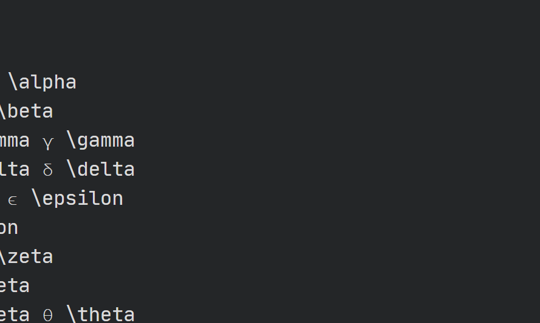

# Initial page

一、第一章 1. 给定一个乘法表（数独）一定对应一个群吗？ 不是。如下图

1. 是否可以由一个元素构造出无限阶的幂序列群$C^{\inf}$。 不确定，可能如果a的阶是无穷就可以吧。
2. 给出$C^n和C^{\inf}$的定义 
3. 证明两个子群交集还是一个子群，但并集不一定是子群。 证封闭和存在逆即可。{e,a}和{e,b}的并集不是子群。
4. 证H是G的一个有限子群的充要条件是$H^2=H$。 充分性是显然的。必要性证封闭和有逆即可。
5. 可否有GL\(3,R\)属于GL\(4,R\)存在？ 在同构的意义下存在。GL\(3,R\)同构与GL\(4,R\)的矩阵（分为3×3和1×1的块），而这些矩阵是GL\(4,R\)的子群。
6. 无限循环群是否有无限真子群？ 有。全体偶数次幂的。
7. 证群G的中心（跟其他所有元素都对易的元素集合）是一个子群。 封闭和逆。
8. 证群G中和某元素f对易的所有元素集合也是一个子群。 封闭和逆。
9. 证明指标为2的子群是不变的。 因为左陪集等于右陪集。
10. 对一个群G做子群H的陪集分解{H,aH,bH,...}，问是否一定能从每个陪集中抽出一个元素使其构成子群。 不一定。如D3群就可以，但是四阶循环群C4就不可以。
11. 证如果一个映射保乘的话，一定是单位元对应单位元，逆对应逆。 先证单位元对应单位元，再证逆。
12. 证两个子群G1、G2的直积群是群G的一个子群。跟群是两个子群的直积有何不同。 封闭和逆。G1和G2不一定是不变的，也就没有商群的同构关系，但还是可交换且共同元素只有单位元。
13. B\(G\)是否是群G在子空间W的表示？荷载的B\(G\)基是什么？ 不是。因为子空间W不是G不变的。
14. Abel群可以存在2D不可分表示吗？ 可以。如\[1,x;0,1\]
15. 阶为素数的群都是循环群？ 对。
16. 如何判断表示等价和可约？ 等价：按定义，等价找出可逆矩阵；按舒尔引理，如果找到非0矩阵M；按特征标。 可约：按定义，找出矩阵S；按舒尔引理；特征标。
17. 非一维的正则表示一定可约。
18. 直积群类的个数等于其因子群类的个数的乘积。 用个逆作用到群元上去，再用对易关系得到。
19. 如何给出一个群的子群？ 从循环群可以构造出。但非循环群则不知道。
20. Abel群的所有子群都是不变子群？ 对。

## 第三四章

1. 我们知道SO\(2\)是Abel群，那么O\(2\)是不是呢？ 泡利矩阵x,z
2. SO\(3\)的李代数有3个生成元，那么SO\(2\)的李代数有多少个生成元？ 1个
3. O\(3\)可以写成SO\(3\)和{1,-1}的直积，那么O\(2\)能否写成SO\(2\)和{1,-1}的直积？ 不可以，因为构造不出行列式为-1的
4. 给出一个置换如何判断是奇置换还是偶置换？ 看置换长度，如果是偶数就是奇置换，否则偶置换
5. 怎么证明so\(3\)李代数的表示都是0迹的？ W-E定理
6. 所有标量算符都是不可约张量算符。

